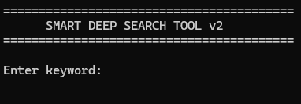

# 🔍 DEEPSEARCH_LOCAL

<p align="center">
  
  
  
</p>

<p align="center">
  
</p>

<p align="center">
  Fast local document search powered by the Windows Search Index.
</p>

---

## Overview

**DEEPSEARCH_LOCAL** is a lightweight PowerShell utility that performs instant full-text searches across indexed documents on your Windows system.

Instead of manually browsing folders, the tool leverages the Windows Search service to locate relevant documents by content and allows you to open matching files directly from an interactive console interface.

---

## Features

✅ Full-text document search

✅ Uses the built-in Windows Search Index

✅ Supports:

* PDF (`.pdf`)
* Microsoft Word (`.docx`)
* Microsoft Excel (`.xlsx`)

✅ Interactive command-line interface

✅ Open multiple search results at once

✅ No external dependencies

✅ Lightweight and portable

---

## Requirements

* Windows 10 / Windows 11
* Windows Search Service enabled
* Indexed document locations
* PowerShell 5.1 or later

---

## Repository Structure

```text
DEEPSEARCH_LOCAL
│
├── SearchTool.cmd
├── DeepSearch.ps1
└── README.md
```

---

## Usage

Launch the tool:

```cmd
SearchTool.cmd
```

Enter a keyword:

```text
Enter keyword: invoice
```

Example output:

```text
Found 3 matching document(s).

1. C:\Documents\Invoice_2025.pdf
2. D:\Reports\ClientInvoice.docx
3. C:\Finance\Invoices.xlsx
```

Open selected results:

```text
1 2
```

Commands:

| Command | Description  |
| ------- | ------------ |
| S       | Search Again |
| E       | Exit         |

---

## How It Works

The tool queries the Windows Search Index using:

```sql
SELECT System.ItemPathDisplay
FROM SYSTEMINDEX
WHERE FREETEXT('keyword')
```

Results are filtered to:

* `C:\`
* `D:\`

And file types:

* `.pdf`
* `.docx`
* `.xlsx`

Selected files are then opened using their default Windows applications.

---

## Why Use DEEPSEARCH_LOCAL?

* Instant results from indexed content
* No database setup required
* Minimal system resource usage
* Ideal for large document collections
* Works completely offline
* Built entirely with PowerShell

---

## Screenshot

Add a screenshot here:

```markdown

```

---

## Contributing

Contributions, bug reports, and feature suggestions are welcome.

1. Fork the repository
2. Create a feature branch
3. Commit your changes
4. Submit a Pull Request

---

## License

This project is licensed under the MIT License.

---

## Author

Developed by **Nekofied**

If you find this project useful, consider giving it a ⭐ on GitHub.
